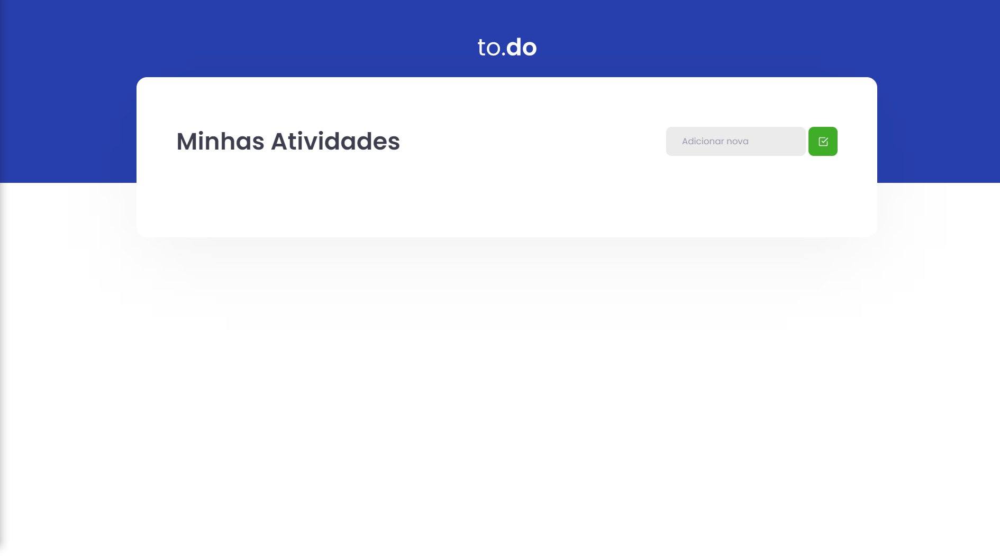
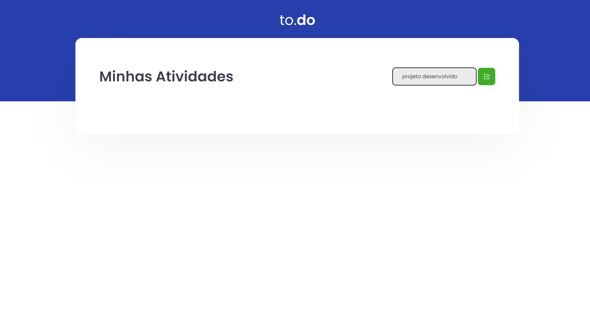
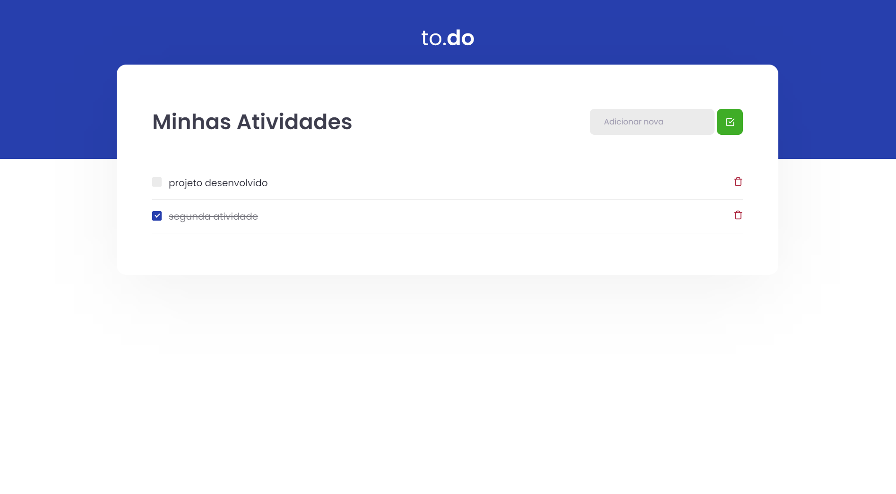

# To.do List

- Projeto desenvolvido afim de praticar.

## Clonar e rodar o projeto

Para fazer o clone do projeto e rodar ele

clonar o projeto

```bash
  git clone
```

Acessar a pasta

```bash
  cd challenge-ignite-01
```

Instalar as dependência

```bash
  yarn
```

Rodar o projeto

```bash
  yarn dev
```

## Tecnlogias utilizadas

- ReactJS
- TypeScript
- Sass
- React icons




